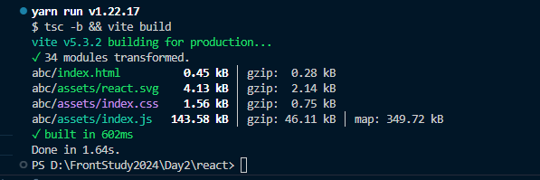
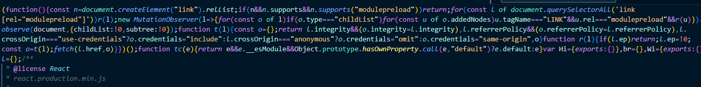
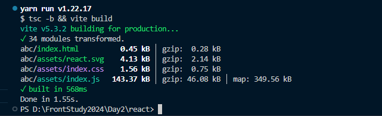
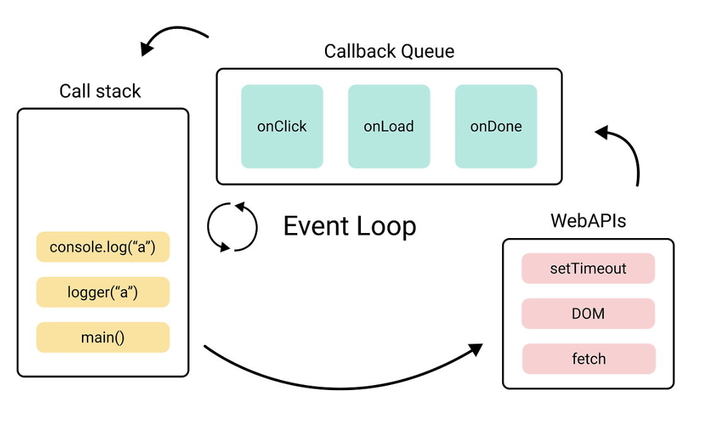
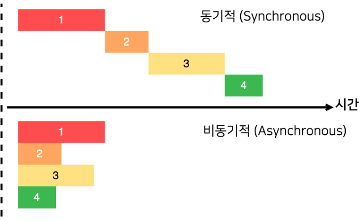

- Transpiler와 Bundler는 각각 무엇인가요??
  - **Transpiler** : 특정 언어로 작성된 코드를 비슷한 다른 언어로 변환시키는 행위<br />
    즉, ES6+ 코드는 모든 브라우저가 기능을 제공하고 있지 않기 때문에 이를 ES5로 변환 시키는 과정이 필요한데 이걸 트랜스파일러 작업을 수행해 준다<br />
    트랜스 파일러로써는 `babel`이 있다.<br />
    [babel](https://babeljs.io/)
  - **Bundler** : 웹 애플리케이션에 있는 여러파일(html, css, js, 이미지 등등) 하나의 번들 파일로 합치는 과정<br />
    로딩 속도를 개선하고 성능 향상에 도움이 된다.<br />
    대표적으로 Webpack, Rollup, vite가 있다.
- webpack에서 loader와 plugin은 각각 무엇인가요??

  - webpack은 기본적으로 javascript및 json파일만 해석이 가능하여 `loader`를 사용해야지 다른 포멧의 파일을 처리하고, 이를 앱에서 사용할 수 있는 모듈로 변환이 가능하다.

    - [로더의 종류](https://webpack.js.org/loaders/)
    - css-loader: css파일을 js코드로 변경 js파일 내부에서 css파일을 불러오는 역할

    ```javascript
    module: {
      rules: [
        // 뒤(sass-loader)에서부터 실행된다 && 모듈로 변경된 css를 js로 읽게함
        {
          test: /\.s?css$/,
          use: ['style-loader', 'css-loader', 'sass-loader'],
        },
      ]
    }
    // test: 로더를 적용할 파일 유형
    // use: 해당 파일에 적용할 로더의 이름
    ```

    - url-loader: 작은 이미지나 글꼴 파일을 복사하지 않고 base64로 변환해서 번들 파일에 넣어 주는 역할

    ```javascript
    {
    test: /\.svg)$/,
    use: {
      loader: 'url-loader',
      options: {
        name: '[name].[ext]?[hash]',
        publicPath: './dist/',
        limit: 10000 // 10kb
      }
    }
    }
    ```

  - **Plugin**: loader는 파일을 해석하고 변환을 했다면 `plugin`은 해당 결과물의 형태를 바꿔주는 역할을 한다.

    ```javascript
    var webpack = require('webpack')
    var HtmlWebpackPlugin = require('html-webpack-plugin')
    module.exports = {
      plugins: [new HtmlWebpackPlugin(), new webpack.ProgressPlugin()],
    }
    ```

    - [HtmlWebpackPlugin](https://webpack.js.org/plugins/html-webpack-plugin/) : 웹팩으로 빌드한 결과물로 HTML 파일을 생성해주는 플러그인
    - [ProgressPlugin](https://webpack.js.org/plugins/progress-plugin/#root) : 웹팩의 빌드 진행율을 표시해주는 플러그인
    - [플러그인 종류](https://webpack.kr/plugins/)

- vite를 이용해서 프로젝트 설정(**실습**) -

1. react + typescript로 세팅

```node
npm create vite@latest hello -- -- template react
또는
yarn create vite
```

2. build 결과물의 폴더를 abc로 변경 (다양한 build options 테스트 해보기)

- css minify
- target es2015, es2020 비교해보기
  - **es2015**<br />
    
    
  - **es2020**<br />
    
    
  - 차이점을 모르겠습니다.
  - 호환성: es2015는 구형 브라우저와의 호환성을 보장하고, es2020은 최신 JavaScript 기능을 활용하므로 최신 브라우저에서만 지원될 수 있다.
  - 성능 및 기능: es2020은 최신 기능을 활용하여 더 성능이 좋고 간결한 코드를 작성할 수 있지만, 이는 최신 브라우저에서만 지원될 수 있다.
- sourcemap 등...
  - 디버깅 용이
  - 오류 추적
  - 코드 이해
  - 개발자 경험 향상

3. 빌드 별과물을 index.js 하나의 파일로 만들기

- plugin 검색 후 추가
  - [vite설정](https://github.com/leeseungje/FrontStudy2024/blob/main/Day2/react/vite.config.ts)
- Webpack과 vite를 비교해 주세요.

  1. 빌드 속도<br />
     `Vite`: 개발 서버가 빠르게 시작하며, HMR(Hot Module Replacement) 속도가 빠릅니다. ES 모듈 기반으로, 변경된 모듈만 갱신합니다.<br />
     `Webpack`: 초기 빌드 속도가 상대적으로 느리며, HMR 성능이 덜 최적화되어 있습니다.
  2. 설정<br />
     `Vite`: 설정이 간단하고 기본값으로도 충분한 기능을 제공합니다.<br />
     `Webpack`: 설정이 복잡하고, 다양한 플러그인과 로더를 사용해 커스터마이즈가 가능합니다.
  3. 생태계<br />
     `Vite`: Vue, React 등 다양한 프레임워크와 잘 통합되며, 플러그인도 지속적으로 증가하고 있습니다.<br />
     `Webpack`: 플러그인과 로더 생태계가 매우 방대하여, 복잡한 프로젝트에 적합합니다.
  4. 번들링 방식<br />
     `Vite`: 개발 시 ES 모듈을 사용하고, 프로덕션 시 Rollup을 사용하여 번들링합니다.<br />
     `Webpack`: 번들링과 개발 서버를 모두 자체적으로 처리합니다.
  5. 사용 사례<br />
     `Vite`: 빠른 개발 환경이 필요한 프로젝트, 특히 Vue와 React 프로젝트에 적합합니다.<br />
     `Webpack`: 대규모 애플리케이션이나 복잡한 설정이 필요한 프로젝트에 적합합니다.
     요약<br />
     `Vite는` 빠르고 간편한 개발 환경을 제공하며, 설정이 용이합니다.<br />
     `Webpack`은 더 많은 기능과 설정 옵션을 제공하며, 복잡한 요구사항을 충족시킬 수 있습니다.

- Event Loop에 대해서 설명해 주세요. \*스레드: 흐름의 단위

  - 브라우저 내부의 call stack, callback Queue, Web Apis등의 요소들을 모니터링 하면서 비동기적으로 실행되는 작업을 관리하고 순서대로 처리하여 브라우저 동작을 제어하는 관리자.<br />
    
    1. `Call Stack`: 자바스크립트 엔진이 실행을 위해 사용되는 메모리 구조
    2. `Web Apis`: 동적으로 생성되는 자바스크립트 객체 저장 공간
    3. `Callback Queue`: 비동기적 작업이 완료되면 실행되는 함수 대기 공간
    4. `Event Loop`: 비동기 함수들을 적절한 시점에 실행시키는 관리자
    5. `Event Table`: 특정 이벤트(timeout, click, mouse등)가 발생되었을때 어떤 callback 함수가 호출되야 하는지 알고 있는 자료 구조
  - Web Apis는 크롬 브라우저에서 멀티 스레드로 구현되어 있서 메인 스레드를 차단하지 않고 다른 스레드를 사용하여 동시에 처리할 수 있는것

- 마이크로 태스크 큐, 태스크 큐

  - Callback Queue에는 (Micro)tack Queue와 Microtask Queue가 있다.
    

    - `tack Queue`: `setTimeout`, `setInterval`, `fetch`, `addEventListener`: 동적 실행되는 콜백함수가 들어가는 queue
    - `microtask queue`: `promise.then`, `process.nextTick`, `MutationObserver`: 와 같은 비동기 호출

      1. Task1 이 콜스택에서 사라진 후
      2. microtask Queue에 쌓여있는 Task 2, Task3, Task4를 모두 처리 후
      3. task Queue에 쌓여있는 Task5, Task6을 하나씩 처리

- var, let, const의 차이점에 대해 설명해 주세요.

  - ES6 이전 변수는 `var`로 선언을 했다.
  - `var` 변수는 재선언이 되고, 업데이트가 가능

  ```javascript
  var greeter = 'hey hi'
  var greeter = 'say Hello instead' // 해당 변수로 바뀜
  ```

  - var 선언데 대한 개선을 반영한 `let`이 현재 변수 선언을 사용하고 있지만<br />
    let은 업데이트는 되지만, 재선언은 불가능
    ```javascript
    let greeting = 'Say Hi'
    // let greeting = 'Say Hello' // error: Identifier 'greeting' has already been declared
    greeting = 'Say Hello'
    console.log(greeting) // Say Hello
    ```
  - `let`을 사용하면 변수가 범위 내에서만 존재하기 때문에 이미 사용한 적이 있는 변수명에 대해서 신경을 쓰지 않아도 된다.<br />
    `var`는 두번이상 사용할 수 있기때문에 변수명을 정할때 헷갈릴 수 있다.
  - `const`는 업데이트도, 재선언도 불가능 하다.<br />
    대신 개체는 업데이트가 불가는 해도 객체로는 업데이트가 가능하다.
    ```javascript
    const c = {
      a: 'hello',
      b: 'myname',
    }
    c.name = 'leeseunge'
    console.log(c) // {a: 'hello', b: 'myname', name: 'leeseunge'}
    ```
  - `var` 변수는 범위 내에서 업데이트 및 재선언할 수 있다. `let` 변수는 업데이트할 수 있지만, 재선언은 할 수 없다. `const` 변수는 업데이트와 재선언 둘 다 불가능하다.

- CSR, SSR, SSG, ISR에 대해서 각각 설명해 주세요.<br />
  - **CSR**(Client Side Rendering)<br />
    클라이언트의 요청에 따라 HTML, React 라이브러리 자체, 개발자가 구현한 소스 코드 등의 파일을 모두 다운로드 한 후 DOM을 구성하고 그려내 화면에 나타내는 것.
    - **_장점_**
      1. Client Side Rendering의 장점으로는 한번 로딩 되면, 빠른 UX를 제공한다.
      2. Client에 화면을 구성하는 대부분의 요소가 존재하기 때문에 서버의 부하가 그만큼 적다.
    - **_단점_**
      1. 서버로부터 화면 구형에 필요한 요소를 받기때문에 로딩 시간이 길다.
      2. 자바스크립트 활성화를 하지않으면 어떠한 페이지도 볼 수 없다.
      3. 초기에 빈HTML 파일만 받기 때문에 어떤내용이 있는지 확인이 어려우며,<br />
         meta태그 따로 설정이 불가능해서 `SEO`가 취약하다.
      4. 클라이언트에 모든 코드를 내려받기 때문에 중요한 로직 및 key값이 노출될 우려가 있어 `보안`이 취약함
      5. SPA는 동적으로 생성되는 콘텐츠는 캐싱이 이루어지지 않아 `CDN`캐시가 안됨
  - **SSR**(Server Side Rendering)<br />
    서버에서 HTML을 생성하여 응답해준다.(Spring + jsp)
    - **_장점_**
      1. 페이지 로딩 시간이 빠름
      2. 자바스크립트를 필요로 하지 않음
      3. SEO 에 좋음
      4. 보안이 뛰어남
      5. 실시간 데이터를 보여줌
      6. 사용자별 필요한 데이터를 사용(mypage 등)
    - **_단점_**
      1. 요청 마다 HTML을 생성하기 때문에, SSG 또는 ISR에 비해 느림
      2. 너무 많은 요청으로 인해 서버의 과부하가 걸릴 수 있음
      3. CDN 캐시가 이루어지지 않음(매 요청마다 콘텐츠를 읽어와 HTML에 포함하여 렌더링 하기때문에 보통 cache를 하지 않음)
      4. 페이지 이동할때마다 화면이 깜빡임
  - **ISR**(Incremental Static Regeneration)<br />
    서버측에서 주기적으로 HTML을 서버에서 생성해두고 내려줌(처음 빌드 시점에 만들어두고, 설정한 주기마다 다시 렌더링하여 HTML을 생성해둔다)
    - **_장점_**
      1. 페이지 로딩 시간이 빠름
      2. 자바스크립트를 필요로 하지 않음
      3. SEO 에 좋음
      4. 보안이 뛰어남
      5. CDN 캐시 가능
      6. 데이터가 주기적으로 업데이트가 이루어짐
    - **_단점_**
      1. 실시간 데이터가 아님
      2. 사용자별 정보 제공의 어려움(mypage 같은걸 사용자별로 다 HTML을 미리 생성해 놓을순 없다)
  - **SSG**(Static Site Generation)<br />
    서버에서 정적인 HTML을 미리 생성한다. 생성 시점은 Next.js 빌드시점
    - **_장점_**
      1. 페이지 로딩 시간이 빠름
      2. 자바스크립트를 필요로 하지 않음
      3. SEO 에 좋음
      4. 보안이 뛰어남
      5. CDN 캐시 가능
    - **_단점_**
      1. 정적인 내용
      2. 실시간 데이터가 아님
      3. 사용자별 정보 제공의 어려움(mypage 같은걸 사용자별로 다 HTML을 미리 생성해 놓을순 없다)
  - `SSG`와 `SSR`은 서버측에서 헨더링하지만, build 시점인지 runtime시점 인지에 대한 차이가 존재
  - Next.js는 기본적으로 SSG로 동작
  - Next.js는 다양한 렌더링 방식 제공과 이를 적절히 혼합해서 사용 가능
  - **하이브리드 렌더링**<br />
    목적을 달성하기 위해 두개 이상의 기능이나 요소를 결합<br />
    홈페이지는 `ISR`로<br />
    about 페이지는 잘 변경되지 않기 때문에 `SSG`로<br />
    사용자의 profile페이지는 `CSR/SSR`을 하이브리드해서 만들 수 있다.
- React Hydrate는 무엇인가요??<br />
  서버사이드에서 렌더링된 HTML에 JavaScript를 결합하여서
  이벤트가 동작할 수 있도록 만드는 과정을 `Hydration`이라고 한다.

  1. 서버에서는 Next.js를 사용하여 리액트 애플리케이션을 렌더링하고, 생성된 HTML을 클라이언트로 전송합니다.
  2. 클라이언트에서는 전송된 HTML을 가져와서 기존 마크업과 일치시킵니다.
  3. 일치하는 컴포넌트를 찾아 해당 컴포넌트의 이벤트 처리 및 상태 업데이트를 활성화합니다.
  4. 클라이언트에서는 이제 일반적인 리액트 애플리케이션처럼 동작하며, 상호작용과 상태 변화에 따라 UI를 업데이트할 수 있습니다.

  - **_문제점_**

    - 서버에서 렌더링된 HTML과 클라이언트에서 생성되는 컴포넌트의 마크업이 일치해야 한다. 일치하지 않는 경우에는 에러가 발생할 수 있다.

  - 이해를 좀 더 해야 할듯

- Nextjs에서 app 라우터와 pages 라우터의 차이점은??

  - next.js는 파일 시스템 기반으로 라우팅 구현 여기서 App Router와 Pages Router가 있다.
  - 크게 App / Pages 라우터의 기본적인 폴더 구조의 경로로 시작

    - **APP**
      -Next.js 13 버전에서 새롭게 도입된 라우팅 컨벤션이며 컴포넌트 기반 라우팅을 사용
      - **_구조_**
        - app 폴더를 루트 폴더로 사용
        - pages 폴더는 사용안함
        - 라우팅은 app/routes.js 파일에서 설정
        - 각 페이지는 app/폴더명 폴더에 위치한 컴포넌트로 구성
      - **_특징_**
        - 컴포넌트 기반 라우팅으로 코드 조직 및 관리가 편함
        - 레이아웃 구성 및 재사용이 간편
        - 서버 액션, 파일 시스템 기반 라우팅 등을 지원
    - **Pages**
      - Next.js 12버전 이하에서 사용하던 라우팅 컨벤션이며 파일 시스템 기반 라우팅을 사용
      - **_구조_**
        - pages 폴더를 루트 폴더로 사용
        - 각 페이지는 pages 폴더 내에 index.js 파일로 구성
        - URL 경로는 pages 폴더의 구조에 따라 결정
      - **_특징_**
        - 파일 시스템 기반 라우팅으로 직관적이고 이해하기 쉬움
        - 기존 Next.js 프로젝트와 호환
        - 정적 페이지 생성에 적합
      - ***차이점***
        - streaming SSR

  - [참조](https://yozm.wishket.com/magazine/detail/2324/)

* 동기와 비동기
  
