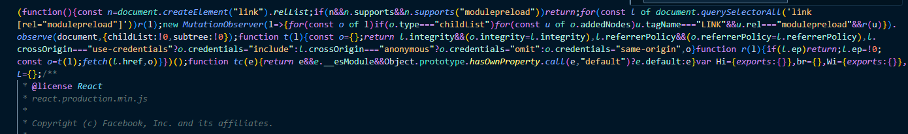

- Transpiler와 Bundler는 각각 무엇인가요??
  - **Transpiler** : 특정 언어로 작성된 코드를 비슷한 다른 언어로 변환시키는 행위<br />
    즉, ES6+ 코드는 모든 브라우저가 기능을 제공하고 있지 않기 때문에 이를 ES5로 변환 시키는 과정이 필요한데 이걸 트랜스파일러 작업을 수행해 준다<br />
    트랜스 파일러로써는 `babel`이 있다.<br />
    [babel](https://babeljs.io/)
  - **Bundler** : 웹 애플리케이션에 있는 여러파일(html, css, js, 이미지 등등) 하나의 번들 파일로 합치는 과정<br />
    로딩 속도를 개선하고 성능 향상에 도움이 된다.<br />
    대표적으로 Webpack, Rollup, vite가 있다.
- webpack에서 loader와 plugin은 각각 무엇인가요??

  - webpack은 기본적으로 javascript및 json파일만 해석이 가능하여 `loader`를 사용해야지 다른 포멧의 파일을 처리하고, 이를 앱에서 사용할 수 있는 모듈로 변환이 가능하다.

    - [로더의 종류](https://webpack.js.org/loaders/)
    - css-loader: css파일을 js코드로 변경 js파일 내부에서 css파일을 불러오는 역할

    ```javascript
    module: {
      rules: [
        // 뒤(sass-loader)에서부터 실행된다 && 모듈로 변경된 css를 js로 읽게함
        {
          test: /\.s?css$/,
          use: ['style-loader', 'css-loader', 'sass-loader'],
        },
      ]
    }
    // test: 로더를 적용할 파일 유형
    // use: 해당 파일에 적용할 로더의 이름
    ```

    - url-loader: 작은 이미지나 글꼴 파일을 복사하지 않고 base64로 변환해서 번들 파일에 넣어 주는 역할

    ```javascript
    {
    test: /\.svg)$/,
    use: {
      loader: 'url-loader',
      options: {
        name: '[name].[ext]?[hash]',
        publicPath: './dist/',
        limit: 10000 // 10kb
      }
    }
    }
    ```

  - **Plugin**: loader는 파일을 해석하고 변환을 했다면 `plugin`은 해당 결과물의 형태를 바꿔주는 역할을 한다.

    ```javascript
    var webpack = require('webpack')
    var HtmlWebpackPlugin = require('html-webpack-plugin')
    module.exports = {
      plugins: [new HtmlWebpackPlugin(), new webpack.ProgressPlugin()],
    }
    ```

    - [HtmlWebpackPlugin](https://webpack.js.org/plugins/html-webpack-plugin/) : 웹팩으로 빌드한 결과물로 HTML 파일을 생성해주는 플러그인
    - [ProgressPlugin](https://webpack.js.org/plugins/progress-plugin/#root) : 웹팩의 빌드 진행율을 표시해주는 플러그인
    - [플러그인 종류](https://webpack.kr/plugins/)

- vite를 이용해서 프로젝트 설정(**실습**) -

1. react + typescript로 세팅

```node
npm create vite@latest hello -- -- template react
또는
yarn create vite
```

2. build 결과물의 폴더를 abc로 변경 (다양한 build options 테스트 해보기)

- css minify
- target es2015, es2020 비교해보기
  - **es2015**<br />
    
    
  - **es2020**<br />
    
    
  - 차이점을 모르겠습니다.
  - 호환성: es2015는 구형 브라우저와의 호환성을 보장하고, es2020은 최신 JavaScript 기능을 활용하므로 최신 브라우저에서만 지원될 수 있다.
  - 성능 및 기능: es2020은 최신 기능을 활용하여 더 성능이 좋고 간결한 코드를 작성할 수 있지만, 이는 최신 브라우저에서만 지원될 수 있다.
- sourcemap 등...
  - 디버깅 용이
  - 오류 추적
  - 코드 이해
  - 개발자 경험 향상

3. 빌드 별과물을 index.js 하나의 파일로 만들기

- plugin 검색 후 추가
  - [vite설정](https://github.com/leeseungje/FrontStudy2024/blob/main/Day2/react/vite.config.ts)
- Webpack과 vite를 비교해 주세요.

  1. 빌드 속도<br />
     `Vite`: 개발 서버가 빠르게 시작하며, HMR(Hot Module Replacement) 속도가 빠릅니다. ES 모듈 기반으로, 변경된 모듈만 갱신합니다.<br />
     `Webpack`: 초기 빌드 속도가 상대적으로 느리며, HMR 성능이 덜 최적화되어 있습니다.
  2. 설정<br />
     `Vite`: 설정이 간단하고 기본값으로도 충분한 기능을 제공합니다.<br />
     `Webpack`: 설정이 복잡하고, 다양한 플러그인과 로더를 사용해 커스터마이즈가 가능합니다.
  3. 생태계<br />
     `Vite`: Vue, React 등 다양한 프레임워크와 잘 통합되며, 플러그인도 지속적으로 증가하고 있습니다.<br />
     `Webpack`: 플러그인과 로더 생태계가 매우 방대하여, 복잡한 프로젝트에 적합합니다.
  4. 번들링 방식<br />
     `Vite`: 개발 시 ES 모듈을 사용하고, 프로덕션 시 Rollup을 사용하여 번들링합니다.<br />
     `Webpack`: 번들링과 개발 서버를 모두 자체적으로 처리합니다.
  5. 사용 사례<br />
     `Vite`: 빠른 개발 환경이 필요한 프로젝트, 특히 Vue와 React 프로젝트에 적합합니다.<br />
     `Webpack`: 대규모 애플리케이션이나 복잡한 설정이 필요한 프로젝트에 적합합니다.
     요약<br />
     `Vite는` 빠르고 간편한 개발 환경을 제공하며, 설정이 용이합니다.<br />
     `Webpack`은 더 많은 기능과 설정 옵션을 제공하며, 복잡한 요구사항을 충족시킬 수 있습니다.

- Event Loop에 대해서 설명해 주세요.
- 마이크로 태스크 큐, 태스크 큐
- var, let, const의 차이점에 대해 설명해 주세요.
- CSR, SSR, SSG, ISR에 대해서 각각 설명해 주세요.
- React Hydrate는 무엇인가요??
- Nextjs에서 app 라우터와 pages 라우터의 차이점은??
