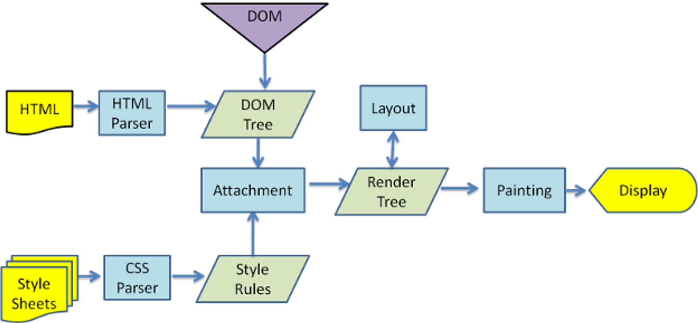

# FrontEnd Study 2024

## 목표

- 프론트엔드 기본 이론
- 라이브러리, 개발환경 등을 **왜** 사용하는지??

## 진행방법

- 각 아젠다를 최대한 미리 예습 후 참석

## 아젠다

### Day1 (6/25 예정)

- [FrontEnd Roadmap](https://roadmap.sh/frontend)
- W3C는 뭐하는 곳인가요??

  - www표준을 개발하고 장려하는 조직, World Wide Web Consortium
  - 웹 표준을 개발하는 국제 컨소시엄

- 표준이 정의되는 단계는??

  - Working Draft(WD) - 초안 (첫단계)
  - Candidate Recommendation (CR) : 후보권고안 (컴토)
  - Proposed Recommendation (PR) : 제안권고안 (완성된 문서 최종 승인)
  - W3C Recommendation(REC) : 권고안 (승인완료)

- 웹 표준이란? 웹 접근성이란?
  - 웹 표준: 웹사이트에 접속한 사용자가 어떠한 운영체제나 브라우저를 사용하더라도 동일한 결과를 보이게 하는 것이다.
    - css로 시각표현 통일
    - 모바일에서도 정상적인 작동 및 사용자 접속 장치의 접근성 용이
    - SEO(검색엔진 최적화)
    - 효율적인 마크업이 최소화되어 페이지 로딩속도 향상
    - 다양한 브라우저에서도 작동
  - 웹 접근성: 장애인, 고령자 등 모든 사용자가 어떠한 기술이나 환경에서도 전문적인 능력 없이 웹사이트에서 제공하는 모든 정보를 동등하게 접근하고 이해할 수 있는 권리

* 자바스크립트 표준은?? - ECMA 국제 기구에서 'ECMAScript standard'라는 스크립트 표준을 만듦
  - ECMAScript에 포함되는 항목에는 다음과 같은 예가 있다.
  - ES6 란??
    - 2015년에 제정된 ECMAScript 표준을 ES6라고 부른다.
    - TypeScript의 기반이 되는, 클래스 문법과 모듈 기능 추가, IE9 부터 지원
      - 화살표 함수
      - 모듈화 지원
      - Promise
      - 해체 할당, Spread 연산자
  - ES7 이후??
    - ES2016 ES7
      - 제곱 연산자(\*\*)
      - includes() 메소드로 특정 값 포함 확인
    - ES2017 ES8
      - async await
      - Objdect 심화 메소드(졸려서 공부 못함)

```javascript
// ES7
const result = 5 ** 2 // 5 X 5 = 25
const nums = [1, 3, 5, 7]
console.log(nums.includes(3)) // result true
array.includes(item, fromIndex)
/**
 * item: 찾고자 하는 특정한 항목
 * fromIndex: 시작할 index
 */
```

- 브라우저에 https://www.naver.com 입력 후 화면에 렌더링 되기까지의 **모든 과정**
  - 
- Virtual Dom 이란??
  - 실제 Dom의 변경 사항을 빠르게 파악하고 반영하기 위해서 내부적으로 가상 Dom을 만들어서 관리, Dom의 요약본
  - 변경 전과 변경 후의 상태를 비교 한뒤 최소한의 내용만 반영하여 성능 향상을 이끌어냄
- Svelte는 virtual DOM을 사용하지 않는데 차이점은??

  - 어떤 이벤트나 실제 일어날 일들이 들어오면 어떤 변화가 일어날지들을 컴팩한 자바스크립트 파일로 컴파일해서 내놓기 때문에 virtual DOM이 사용되지 않는다.
  - 용량 면에서 더 가볍고 Dom의 조작도 더 빠르다.
  - 단점은 가벼운 형태의 사이트에서는 좋을수는 있으나 무거운 사이트에서는 React가 좋다.

- cors란?? - Cross-Origin Resource Sharing(교차 출저 리소스 공유)

  - 출처를 구성하는 세 요소는 프로토콜·도메인(호스트 이름)·포트로, 이 중 하나라도 다르면 CORS 에러가 난다.

    - 해결하는 방법은??
      - 더 다양한 방법이 있는데 졸려서 패스
      - Access-Control-Allow-Origin<br />
        만약 Access-Control-Allow-Origin 헤더에 " \* " (모든 도메인)을 명시한다면, 모든 도메인에서 해당 자원에 접근할 수 있도록 허용<br />
        하지만, 이 경우 보안상의 이유로 권장되지 않는다.

- commonjs와 esm의 차이점은??

  - commonjs
    - `require`로 모듈에 접근하고 `module.exports`로 모듈을 내보내는 ESM 방식
    - 모듈에 접근할때 require()
    ```javascript
    const utils = require('utils')
    ```
    - 모듈을 내보낼때, `module.exports`
    ```javascript
    const calculator = require('./calculator.js')
    const { add } = require('./calculator.js')
    console.log(calculator.add(2, 2)) // 출력: 4
    console.log(add(2, 2)) // 출력: 4
    ```
  - esModule

    - import로 모듈에 접근하고 export로 모듈을 내보내는 ESM 방식

      - ESM 방식을 사용하기 위해선 package.json에 `“type”: “module”`을 설정
      - **import**
        - 모듈에 접근할때
        ```javascript
        import React from 'react'
        ```
      - **export**

        - export로 내보낸 모듈은 import로 접근할 수 있다.

        ```javascript
        // a.js
        export const name = () => {}

        // b.js
        import name from 'a.js'
        ```

- null 과 undefined의 차이점은?
  - null 은 의도적으로 비어있고, undefined는 변수나 값이 주어지지않은 값에 자동 할당
  ```javascript
  undefined == null // true
  undefined === null // false
  typeof null // object
  typeof undefined // undefined
  ```
